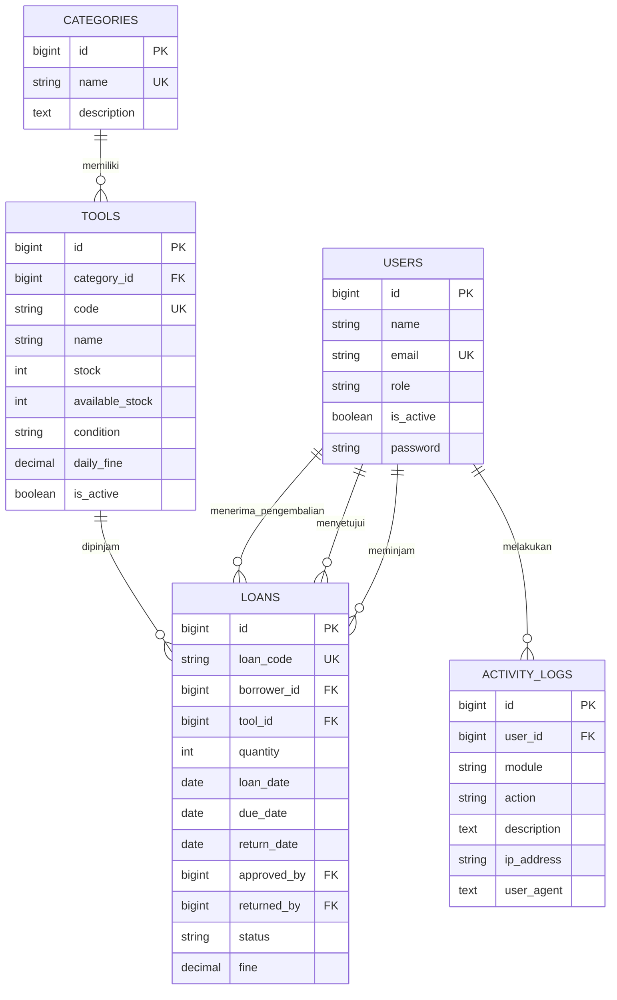

# ERD Aplikasi Peminjaman Alat

```mermaid
erDiagram
    USERS ||--o{ LOANS : meminjam
    USERS ||--o{ LOANS : menyetujui
    USERS ||--o{ LOANS : menerima_pengembalian
    USERS ||--o{ ACTIVITY_LOGS : melakukan
    CATEGORIES ||--o{ TOOLS : memiliki
    TOOLS ||--o{ LOANS : dipinjam

    USERS {
        bigint id PK
        string name
        string email UK
        string role
        boolean is_active
        string password
    }
    CATEGORIES {
        bigint id PK
        string name UK
        text description
    }
    TOOLS {
        bigint id PK
        bigint category_id FK
        string code UK
        string name
        int stock
        int available_stock
        string condition
        decimal daily_fine
        boolean is_active
    }
    LOANS {
        bigint id PK
        string loan_code UK
        bigint borrower_id FK
        bigint tool_id FK
        int quantity
        date loan_date
        date due_date
        date return_date
        bigint approved_by FK
        bigint returned_by FK
        string status
        decimal fine
    }
    ACTIVITY_LOGS {
        bigint id PK
        bigint user_id FK
        string module
        string action
        text description
        string ip_address
        text user_agent
    }
```
